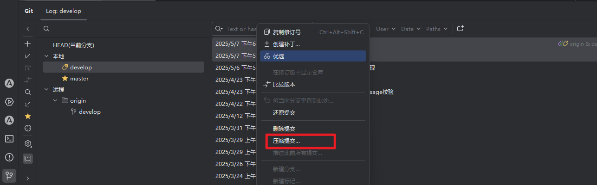

# 提交规范
在开发提交时，限制commit提交信息能够帮助我们清晰地直到变更内容，查看历史记录时也能快速浏览查到找需要的信息

甚至可以通过命令进行过滤查找: `git log --oneline --grep "^feat|^fix|^pref"`

也可以依据某些类型的 commit 提交触发构建或者发布流程

## commit Message
commit message 包含三个部分 **Header**、**Body** 和 **Footer**
```text
<type>[optional scope]: <description>
// 空行
[optional body] 
// 空行
[optional footer(s)]
```

Header 必须， body 和 footer 可以省略。  

type类型:
- feat: production 新增功能
- fix: product bug 修复
- perf: product 性能优化
- refactor: product 简化代码、重命名变量、删除冗余代码
- style: develop 代码格式化
- test: develop 新增测试代码用例或更新现有测试用例
- ci: develop CI 流程相关配置改动, jenkins、gitlab ci
- docs: develop 文档改动, 包括修改用户文档或开发文档
- chore: develop 构建流程，依赖管理或辅助工具变动

scope 是说明 commit 的影响范围， 比如 user, department

# 压缩提交
对于多次相同的提交， 可以将多个提交进行合并。 go ide 可以图形化压缩提交。  


也可以通过 git rebase 进行压缩提交

# 本地提交限制
.git/hooks是git提交的各种钩子，我们现在对git提交的分支和提交消息进行限制

scripts/githooks/pre-commit 是提交分支限制
scripts/githooks/commit-msg 是提交信息限制

在执行 makefile 中的任一指令时， 会将这两个文件移动到 .git/hooks文件中， 提交时会自动进行限制