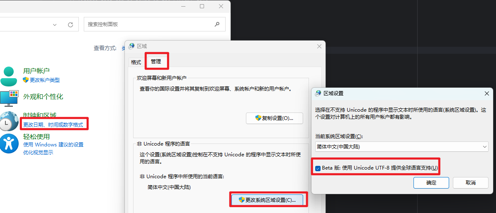

# 为什么使用makefile
makefile 有很强大的项目管理能力，能够帮助我们快速，简单的执行需要的命令。

# 安装makefile
## 使用windows安装makefile
使用choco命令行安装make, 需要使用管理员打开powershell

```shell
# 设置chocolatey 安装目录, 默认安装到 C:\ProgramData\chocolatey
[System.Environment]::SetEnvironmentVariable("ChocolateyInstall", "D:\ProgramData\chocolatey", "Machine")

# 安装choco
Set-ExecutionPolicy Bypass -Scope Process -Force; [System.Net.ServicePointManager]::SecurityProtocol = [System.Net.ServicePointManager]::SecurityProtocol -bor 3072; iex ((New-Object System.Net.WebClient).DownloadString('https://community.chocolatey.org/install.ps1'))

# 查看choco版本
choco -v

# 安装make
choco install make
```

## 设置控制台输出支持UTF-8
windows 默认支持为GBK, 我们编写Makefile的输出为utf8, 需要设置支持utf-8

1. 打开控制面板
2. 选择更改日期，时间或数字格式
3. 切换到管理
4. 更改系统区域设置
5. 选中 `Bate 版: 使用Unicode UTF-8 提供全球语言支持(U)`
6. 重启电脑



# makefile 学习指南
[跟我一起写Makefile(陈皓)](https://scc.ustc.edu.cn/_upload/article/files/7d/f9/033cd3b84a9d8a16b2b2eb9987e6/W020150417520333830657.pdf)

# makefile文件详解
本项目makefile结构目录如下:
```text
|--Makefile  
|--scripts  
|--|--make-rules     
|--|--|--env.mk    
|--|--|--comment.mk  
|--|--|--...  
```

## Makefile 解释
```makefile
# 设置默认执行命令为 all
.DEFAULT_ALL = all

# env.mk 是每个人的系统中执行的命令位置
# 或者是每个系统中特殊的文件配置
# 每个人根据自己的系统进行对应的配置后，不进行提交
include ./scripts/make-rules/env.mk 
# make执行时需要进行的公共处理
include ./scripts/make-rules/common.mk

## help: 帮助命令
# 获取每个指令的注释， 使用 ## 开头, : 做分割 
# 这个指令不仅会获取当前Makefile中的命令解析
# 也会获取 scritps/make-rules 文件夹下以 .mk 结尾文件的指令的注释
.PHONY: help
help: Makefile
	@echo "操作系统：$(GOOS)"
	@printf "\n使用: make <TARGETS> \n\n命令:\n"
	@sed -n 's/^##//p' $< | column -t -s ':' | sed -e 's/^/ /'
	@$(FIND) ./scripts/make-rules -name "*.mk" | xargs sed -n 's/^##//p' | column -t -s ':' | sed -e 's/^/ /'
```

后续有其他命令会逐步进行添加
 