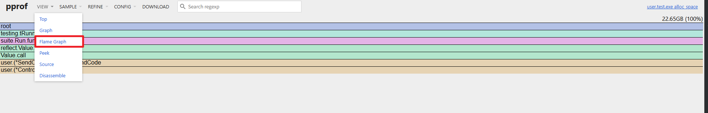
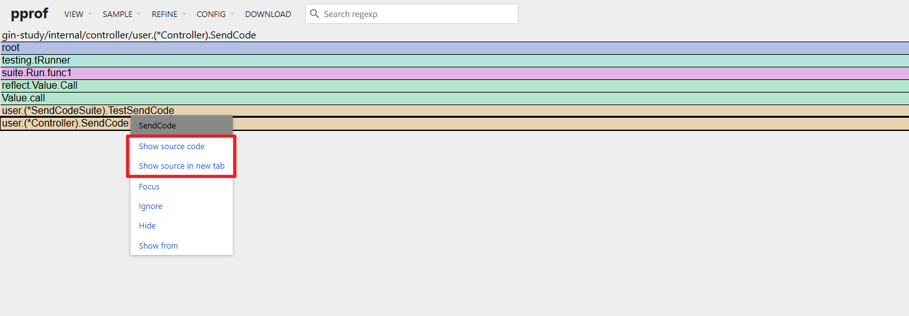
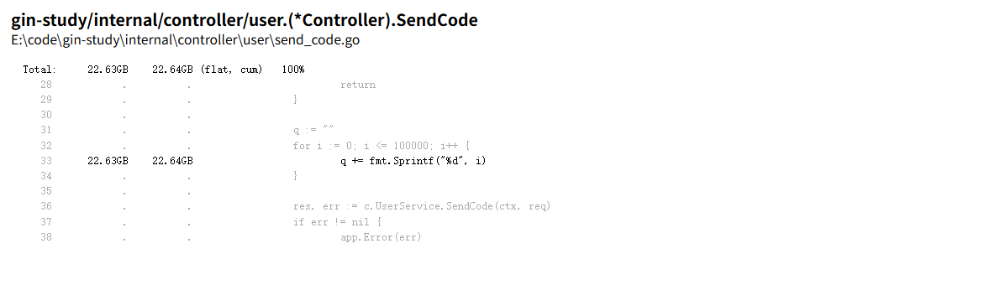
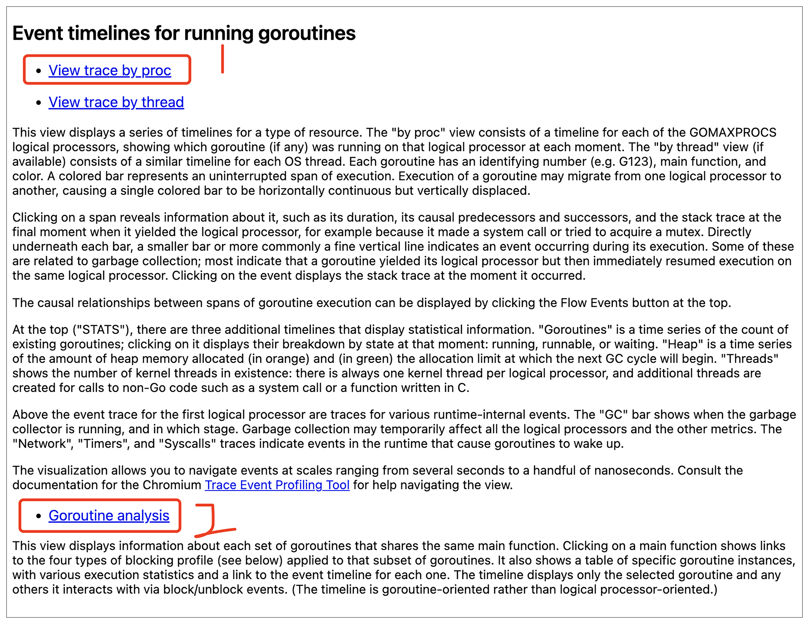
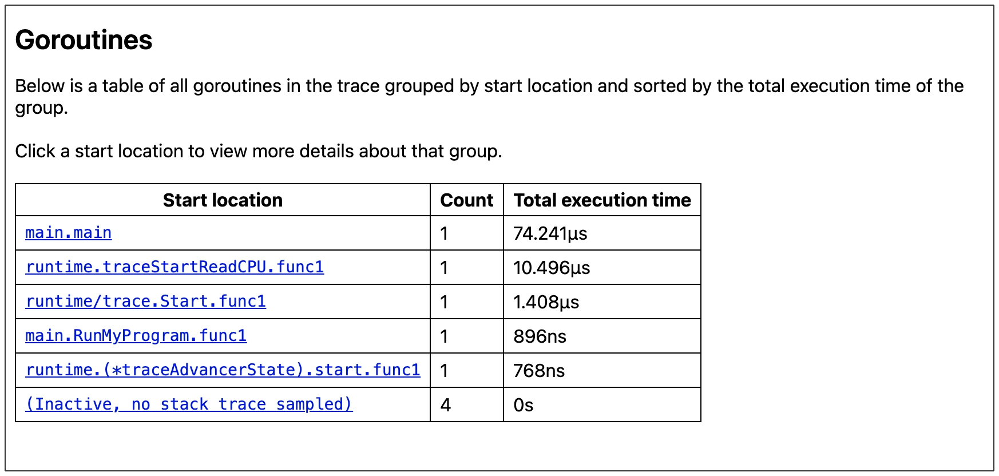
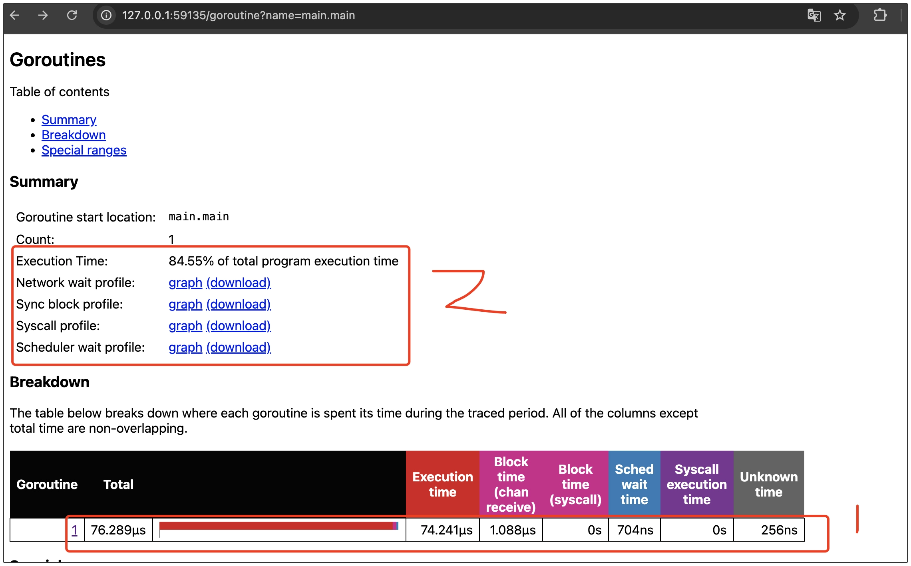
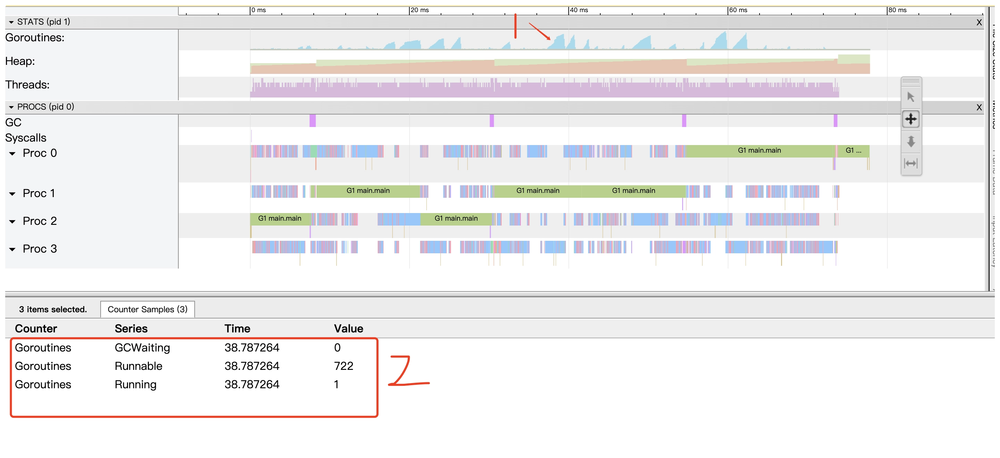
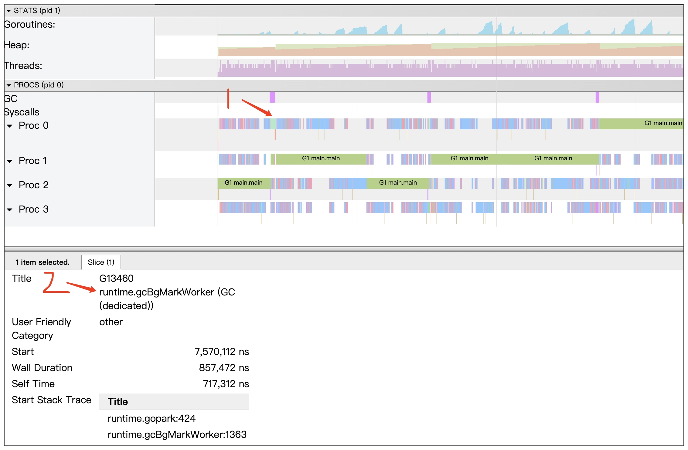

golang 为我们提供了快速定位热点代码的工具 pprof, 它能够定时针对正在运行的GO程序展开采集操作，在这个过程中会全面搜索程序运行时的各类堆栈信息，
像消耗大量CPU的资源的代码片段所在位置，以及内存分配的具体情况。

内存采样分为 allocs 采样 和 heap 采样， allocs 侧重定位频繁进行内存分配的函数， heap 用于查看存活对象分内存分配情况侧重于定位内存泄露问题。

# 单元测试分析
测试 `internal/controller/user/send_code.go` 文件中 `SendCode` 方法时，需要对方法中的cpu，内存，堆栈进行分析。使用命令 
`make pprof.test Func=TestSendCode Package=gin-study/internal/controller/user` 对`TestSendCode`进行采样， make 命令在
`scripts/make-rules/pprof.mk`中，该命令会将采样后文件放在 `_output/pprof` 文件夹下，文件名前缀为方法名。

使用web页面查看内存情况：`make pprof.cpu Func=TestSendCode`，这个命令会在本地开启一个8001端口对采样后内存文件进行分析，
Func参数要与执行 make pprof.test 中的Func相同。

## 查看火焰图
火焰图是按照自顶向下的方式来呈现的，这种排列方法能够清晰展现出函数之前的调用关系。火焰图中每个横条的长度代表对应的资源消耗或者占用的情况。
所以进入到可视化界面后，我们直接查询火焰图。
 
> 在分析的时候，务必要着重关注下一层子调用的资源消耗分布情况。

利用火焰图定位到消耗 CPU 和 内存资源的热点函数代码
  

 
通过上面操作，我们可以查询到消耗内存最多的代码函数，然后进行优化

## benchmark 分析
benchmark 能够协助我们对代码的性能状况进行评估，它主要的操作方式是在规定的一段时间内，不断地重复运行待测试的代码，随后输出代码的执行次数、单次运行的时间和内存分配的相关结果。

基准测试生成采样分析文件和单元测试一样，通过 `make pprof.bench` 进行生成

## trace
pprof 呈现的仅仅是基于采样后得到的聚合信息，并不包含协程运行的详细情况。 trace 会生成可视化视图查看以下信息：
- 协程的创建过程、开始运行的时刻以及结束运行的时间点
- 协程由于系统调用、通道操作、锁的使用情况出现被阻塞的现象
- 网络IO相关的操作情况
- 垃圾收集的相关活动情况

我们可以通过修改 `pprof.trace` 中的地址来获取想要的 trace 文件。 也可以在程序中显示触发和结束
```go
import (
    "runtime/trace"
)

// 埋点触发的方式
func main() {
    // 创建trace性能分析文件
    f, err := os.Create("trace.out")
    if err != nil {
        panic(err)
    }
    defer f.Close()
    
	// 收集trace信息
    if err := trace.Start(f); err != nil {
        log.Fatalf("failed to start trace: %v", err)
    }
    defer trace.Stop()

    // your program here
    RunMyProgram()
}
```
收集到 trace 信息后， 使用 `pprof.trace.show` 进行查看， 一般重点关注下面两个内容，会分别从处理器视角和协程视角分析程序运行情况


如果我们想排查协程阻塞情况，查看协程分析（Goroutine analysis）视图。协程分析视图会将trace期间的所有协程，按运行时间降序排序。


点击单个协程，会进入协程统计页面，可以看到协程运行时间，同步阻塞时间，系统调用阻塞时间、调度延迟时间等，如果协程阻塞时间较长，可以通过点击 `summary` 区域连接，下载 profile 文件定位到具体的阻塞代码


如果我们想要查看处理器使用状况，可以使用 处理器分析视图(view trace by proc)，可以了解多核是否处于被充分使用状态，也能知晓某一特定时刻，处于不同状态的协程数量分别是多少。
假如2区间中 Runnable（可调度） 状态的协程数量较多，说明创建的协程数量过多，cpu无法有效调度


将鼠标移动到 1区域，按 w 进行方法， s进行缩小，点击其中一个进行查看事件详情。如果垃圾回收占用cpu的事件过多，也是一种不健康的运行状态
